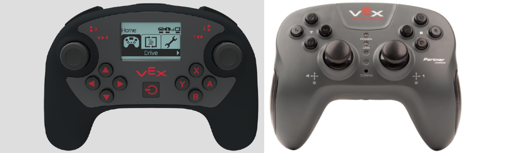

## VEX Robotics Coding Projects

Created by the main programmer of team 6724C (Daniel Shin). As the team determined that a dual driver system (a system commonly utilized by almost all VEX teams where there are two controllers for the robot instead of one) was inefficient, the code contains various optimizations so that a user-friendly, readily controllable system is created.

## Project List:
* VEX 2017-2018 Season: In The Zone
* VEX 2018-2019 Season: Turning Point

## Driver Control Programming

As shown in the image below, there are currently two types of controllers: the original vex joystick and the V5 remote. The V5 remote control is the black one on the left.

As noticed, there are two manipulatable sticks which both have the x and y axis on each controller. Furthermore, there are 8 buttons on the controller as well as 4 more additional buttons that are not shown in the images. These 4 additional buttons are located on the top of the controller, and are more readily accessible compared to the 8 "standard" buttons.  
  
The typical uses of these controls follow as below:

* The rotatable sticks are typically utilized for manipulating the drive chain, or wheels. The reason is because it is possible to manipulate different speeds so that movement can be more smooth.
* The top 4 buttons are the primary go-to buttons for VEX programming, as they typically can be manipulated simultaneously with the sticks as well.
* The other 8 buttons are normally used for tasks that are not frequently used.

The important concept for our team when programming the joystick was that we wanted to only rely on the 4 top buttons. VEX is becoming an increasingly competitive and driver-oriented game, so control over the chassis (drive chain) is essential at all times. (This has become even more important as defence-oriented strategies are becoming increasingly popular).  
  
For us, we normally utilized function-programmed keys, so that each button will go through a pre-programmed task. Obviously, it was important for us to program functions that would not interfere with the rest of the task.  
  
For instance, in the In The Zone season, we had several buttons that ran tasks to control the intake rollers (the intake rollers ran purely autonomously), and we developed methods so that each task wouldn't override each other to create errors in the program.  
  
*likewise, when programming, we prioritized simplicity and accessibility even when we had to give up on some functionality on driving the robot. 

## Image Sources:
* https://help.vex.com/article/91-how-the-v5-controller-improves-the-user-experience
* https://www.vexrobotics.com/joysticks.html
